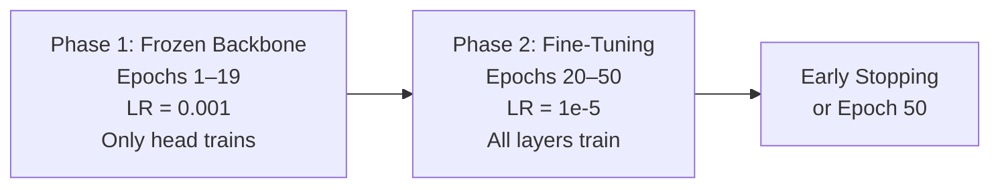
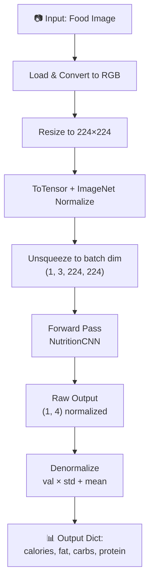
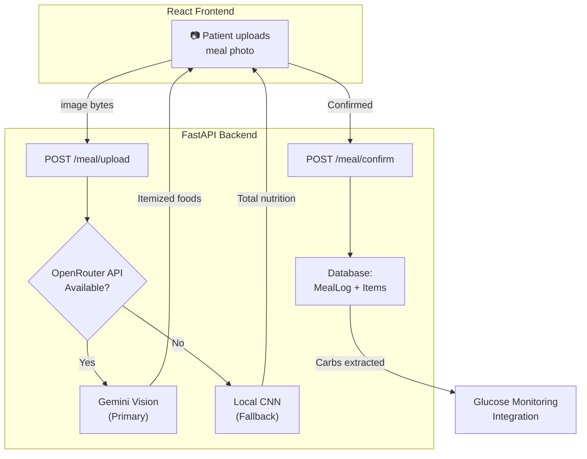

# 🍽️ Computer Vision Project — Food Nutrition Estimation using Deep Learning

## Full Technical Documentation

---

## 1. Project Overview

This Computer Vision (CV) project builds a **deep learning regression model** that estimates the nutritional content of food directly from overhead images. Given a single photograph of a meal, the model predicts four continuous nutritional values:

| # | Output | Unit | Description |
|---|--------|------|-------------|
| 1 | **Total Calories** | kcal | Total energy content of the dish |
| 2 | **Total Fat** | grams | Total fat content |
| 3 | **Total Carbohydrates** | grams | Total carbohydrate content |
| 4 | **Total Protein** | grams | Total protein content |

> [!IMPORTANT]
> This is a **regression model**, NOT a classification model. It does **not** identify food names or categories — it directly predicts numerical nutritional values from pixel data.

---

## 2. Dataset — Nutrition5k

The model is trained on **Google's Nutrition5k dataset**, a large-scale benchmark for vision-based nutrition estimation.

### 2.1 Dataset Source
- **Origin**: Google Research — `gs://nutrition5k_dataset/`
- **Images**: Overhead RGB photographs captured with a RealSense depth camera
- **Format**: Each dish has a unique ID (e.g., `dish_1561662216`) with a corresponding `.jpg` image

### 2.2 Dataset Structure

| File | Description |
|------|-------------|
| `dishes.csv` | Master CSV with **4,770 dishes**, each containing `dish_id`, `total_calories`, `total_mass`, `total_fat`, `total_carb`, `total_protein`, `num_ingrs` |
| `train_ids.txt` | List of dish IDs designated for training |
| `test_ids.txt` | List of dish IDs designated for evaluation |
| `images/` | Directory of overhead RGB images (`{dish_id}.jpg`) |

### 2.3 Dataset Statistics (from `dishes.csv`)

| Column | Description | Example Values |
|--------|-------------|----------------|
| `dish_id` | Unique identifier | `dish_1561662216` |
| `total_calories` | Energy (kcal) | 0.0 – 9,485.8 |
| `total_mass` | Weight (grams) | 1.0 – 3,324.0 |
| `total_fat` | Fat (grams) | 0.0 – 875.5 |
| `total_carb` | Carbs (grams) | 0.0 – 506.1 |
| `total_protein` | Protein (grams) | 0.0 – 108.8 |
| `num_ingrs` | Ingredient count | 1 – 30 |

### 2.4 Data Download (`run_once.py`)

Images are downloaded from Google Cloud Storage using `gsutil`:

```
gs://nutrition5k_dataset/nutrition5k_dataset/imagery/realsense_overhead/{dish_id}/rgb.png
```

The script downloads up to **4,000 dish images** from the training split, converting them to `.jpg` format locally.

---

## 3. Model Architecture

### 3.1 Backbone — MobileNetV2 (Transfer Learning)

The model uses **MobileNetV2** pre-trained on ImageNet as the feature extraction backbone. MobileNetV2 was chosen for being lightweight and suitable for deployment on resource-constrained environments.

```
┌─────────────────────────────────────────────────┐
│               MobileNetV2 Backbone              │
│         (ImageNet pre-trained weights)           │
│                                                   │
│  Input: (batch, 3, 224, 224) RGB image            │
│  Output: (batch, 1280) feature vector             │
│                                                   │
│  First 80 layers: FROZEN during initial training  │
│  All layers: UNFROZEN at epoch 20 for fine-tuning │
└──────────────────────┬──────────────────────────┘
                       │
                       ▼
┌─────────────────────────────────────────────────┐
│         Custom Regression Head                   │
│                                                   │
│  Dropout(0.4)                                     │
│  Linear(1280 → 512) + ReLU + BatchNorm1d(512)    │
│  Dropout(0.3)                                     │
│  Linear(512 → 256) + ReLU + BatchNorm1d(256)     │
│  Dropout(0.2)                                     │
│  Linear(256 → 128) + ReLU                        │
│  Linear(128 → 4)  ← 4 regression outputs         │
└──────────────────────┬──────────────────────────┘
                       │
                       ▼
         [calories, fat, carbs, protein]
```

### 3.2 Key Architecture Decisions

| Decision | Detail | Rationale |
|----------|--------|-----------|
| **Backbone** | MobileNetV2 | Lightweight, efficient, good accuracy-speed tradeoff |
| **Pre-training** | ImageNet1K_V1 | Strong general visual features as initialization |
| **Freeze Strategy** | First 80 layers frozen initially | Prevents catastrophic forgetting during early training |
| **Head Design** | 4-layer MLP with BatchNorm + Dropout | Regularization to prevent overfitting on small dataset |
| **Output Activation** | None (raw linear output) | Regression task — no softmax/sigmoid needed |
| **Weight Init** | Kaiming Normal | Optimal for ReLU activations |

### 3.3 Parameter Count

| Category | Count |
|----------|-------|
| Total Parameters | ~2.8M (MobileNetV2) + ~0.9M (head) |
| Trainable (phase 1) | ~0.9M (head only) |
| Trainable (phase 2) | ~3.7M (all layers unfrozen) |

---

## 4. Data Pipeline (`dataset.py`)

### 4.1 NutritionDataset Class

The custom PyTorch `Dataset` handles:

1. **CSV Loading** — Reads `dishes.csv` and filters to only dishes with available images
2. **Target Normalization** — Z-score normalizes the 4 target values:
   ```
   normalized = (value - mean) / (std + ε)
   ```
   where `ε = 1e-8` prevents division by zero
3. **Image Loading** — Opens `.jpg` images, converts to RGB; falls back to a black 224×224 image on failure
4. **Augmentation** — Applies the training/validation transform pipeline

### 4.2 The Four Target Variables

```python
targets = ['total_calories', 'total_fat', 'total_carb', 'total_protein']
```

These means and standard deviations are **saved alongside the model** in the `.pkl` file so that inference can denormalize predictions back to real-world units.

---

## 5. Training Pipeline (`train.py`)

### 5.1 Training Configuration (Defaults)

| Parameter | Value | Description |
|-----------|-------|-------------|
| Epochs | 50 | Maximum training epochs |
| Batch Size | 32 | Samples per gradient update |
| Initial LR | 0.001 | Learning rate for phase 1 (frozen backbone) |
| Fine-tune LR | 1e-5 | Learning rate for phase 2 (unfrozen backbone) |
| Image Size | 224×224 | Input resolution |
| Unfreeze Epoch | 20 | When to unfreeze all backbone layers |
| Early Stopping | 10 epochs patience | Stops if val loss doesn't improve |
| Optimizer | AdamW (weight_decay=1e-4) | Adaptive optimizer with L2 regularization |
| Scheduler | ReduceLROnPlateau | Halves LR after 3 epochs of no improvement |
| Validation Split | 20% | Proportion of data held for validation |
| Seed | 42 | Reproducibility |

### 5.2 Data Augmentation (Training)

| Transform | Parameters |
|-----------|------------|
| Resize | (256, 256) |
| RandomCrop | 224 |
| RandomHorizontalFlip | 50% |
| RandomVerticalFlip | 20% |
| RandomRotation | ±20° |
| ColorJitter | brightness=0.3, contrast=0.3, saturation=0.2, hue=0.1 |
| Normalize | ImageNet mean/std |

### 5.3 Validation Transform

| Transform | Parameters |
|-----------|------------|
| Resize | (224, 224) |
| Normalize | ImageNet mean/std |

### 5.4 Loss Function

A **combined MSE + MAE loss** is used:

```
L = MSE(pred, target) + 0.5 × MAE(pred, target)
```

- **MSE** penalizes large errors heavily (encourages overall accuracy)
- **MAE** provides robustness to outliers (some dishes have extreme values like 9,485 kcal)

### 5.5 Two-Phase Training Strategy



**Phase 1 (Epochs 1–19):** Only the regression head trains. The backbone's ImageNet features are preserved.

**Phase 2 (Epochs 20+):** All layers are unfrozen with a much smaller learning rate (1e-5) to fine-tune the backbone for nutrition-specific features.

### 5.6 Additional Training Features

- **Gradient Clipping**: `max_norm=1.0` — prevents exploding gradients
- **Mixed Precision (AMP)**: Optional `--use-amp` flag for faster GPU training
- **Checkpointing**: Best model saved based on validation loss
- **Training History**: Full loss curves saved for analysis

---

## 6. Model Outputs

### 6.1 Raw Model Output

The model outputs a **tensor of shape `[batch_size, 4]`** containing **z-score normalized** predictions:

```
Model output: tensor([[-0.3421,  0.1287, -0.5603,  0.8912]])
                       │         │         │         │
                       ▼         ▼         ▼         ▼
                   calories    fat     carbs     protein
                 (normalized) (normalized) (normalized) (normalized)
```

### 6.2 Denormalized Output (Real-World Values)

The inference pipeline converts normalized outputs back to real-world units:

```
real_value = normalized_value × (std + ε) + mean
```

### 6.3 Final Output Format

The `predict_image()` function returns a Python dictionary:

```json
{
  "total_calories": 342.5,
  "total_carb": 28.3,
  "total_fat": 18.7,
  "total_protein": 22.1
}
```

> [!NOTE]
> The keys are sorted alphabetically in the output dictionary. Values are in their original units (kcal for calories, grams for macronutrients).

### 6.4 Example Inference (CLI)

```bash
python inference.py path/to/food_image.jpg --pkl nutrition_cnn.pkl
```

**Sample Output:**
```
Predicted nutrition values:
  total_calories: 342.50
  total_carb: 28.30
  total_fat: 18.70
  total_protein: 22.10
```

Optional JSON export:
```bash
python inference.py food.jpg --output result.json
```

---

## 7. Saved Model Artifacts

### 7.1 Checkpoint File (`best_checkpoint.pth`)
**Size: ~35 MB**

Contains the full training state for resuming:
```python
{
    'epoch': int,                    # Best epoch number
    'model_state_dict': OrderedDict, # Model weights
    'optimizer_state_dict': dict,    # Optimizer state
    'best_val_loss': float,          # Best validation loss achieved
    'history': {                     # Full training history
        'train_loss': [float, ...],
        'val_loss': [float, ...],
        'lr': [float, ...]
    },
    'scaler_state_dict': dict | None # AMP scaler (if used)
}
```

### 7.2 Deployment File (`nutrition_cnn.pkl`)
**Size: ~12 MB**

A self-contained pickle with everything needed for inference:
```python
{
    'model_state_dict': OrderedDict, # Trained weights
    'means': {                       # Per-target means for denormalization
        'total_calories': float,
        'total_fat': float,
        'total_carb': float,
        'total_protein': float
    },
    'stds': {                        # Per-target stds for denormalization
        'total_calories': float,
        'total_fat': float,
        'total_carb': float,
        'total_protein': float
    },
    'targets': ['total_calories', 'total_fat', 'total_carb', 'total_protein'],
    'img_size': 224,                 # Required input size
    'history': dict,                 # Training history
    'best_val_loss': float           # Best validation loss
}
```

### 7.3 Production Model (`best_model.pth`)
**Size: ~47 MB**

A standalone `state_dict` used in the production Smart Medical System deployment.

---

## 8. Inference Pipeline (`inference.py`)

### 8.1 Pipeline Steps



### 8.2 Key Functions

| Function | Purpose |
|----------|---------|
| `load_model(pkl_path)` | Loads model + normalization stats from `.pkl` |
| `get_transform(img_size)` | Returns validation-time preprocessing pipeline |
| `denormalize(label_norm, means, stds, targets)` | Converts z-score predictions to real units |
| `predict_image(image_path, pkl_path)` | End-to-end: image path → nutrition dict |

---

## 9. Integration with Smart Medical System

The CV model is deployed as part of the **Smart Medical System (DiaCheck)** — a full-stack medical application for diabetes management. The nutrition estimation serves as the backend AI for the **Meal Analysis** feature.

### 9.1 System Architecture



### 9.2 Dual-Model Strategy

| Layer | Model | Capability |
|-------|-------|------------|
| **Primary** | OpenRouter Gemini Vision API | Identifies **individual food items** (chicken, rice, peas) with per-item nutrition |
| **Fallback** | Local NutritionCNN (this project) | Estimates **total plate nutrition** (4 aggregate values) |

### 9.3 API Endpoint

**`POST /meal/upload`** — Accepts an image file, returns nutritional analysis.

**CNN Fallback Response Format:**
```json
{
  "meal_name": "Detected Meal",
  "items": [
    {
      "food_name": "Detected Food (AI Estimated)",
      "quantity_desc": "1 serving",
      "confidence_pct": 80.0,
      "carbs_g": 28.3,
      "protein_g": 22.1,
      "fat_g": 18.7,
      "calories": 343
    }
  ]
}
```

### 9.4 Downstream Usage

The **carbs_g** output from meal analysis is automatically extracted and logged in the patient's glucose monitoring profile, enabling the system's AI chatbot to correlate meal carbohydrates with blood sugar trends.

---

## 10. Project File Structure

```
Nutrtition/
├── dish_ids/                    # Raw dish ID lists from Nutrition5k
├── dish_metadata_cafe1.csv      # Extended metadata (2.2 MB)
├── dish_metadata_cafe2.csv      # Extended metadata (101 KB)
├── ingredients.csv              # Per-ingredient nutrition data (3.5 MB)
│
└── nutrtition/                  # ← Main CV module
    ├── model.py                 # NutritionCNN architecture (MobileNetV2 + regression head)
    ├── dataset.py               # NutritionDataset PyTorch Dataset class
    ├── train.py                 # Full training pipeline with 2-phase strategy
    ├── inference.py             # Standalone inference script (CLI + programmatic)
    ├── run_once.py              # One-time data download script (gsutil)
    │
    ├── dishes.csv               # Master dish nutrition labels (4,770 dishes)
    ├── train_ids.txt            # Training split dish IDs
    ├── test_ids.txt             # Test split dish IDs
    ├── images/                  # Downloaded dish images (~23 images + pkl)
    │
    ├── best_checkpoint.pth      # Full training checkpoint (~35 MB)
    ├── best_model.pth           # Production state_dict (~47 MB)
    └── nutrition_cnn.pkl        # Self-contained deployment package (~12 MB)
```

---

## 11. Technology Stack

| Component | Technology | Version/Notes |
|-----------|------------|---------------|
| **Framework** | PyTorch | Deep learning framework |
| **Vision** | torchvision | Pre-trained models + transforms |
| **Backbone** | MobileNetV2 | ImageNet pre-trained |
| **Data** | Pandas, NumPy | CSV processing + numerical ops |
| **Imaging** | Pillow (PIL) | Image loading/conversion |
| **Training** | tqdm | Progress bars |
| **Serialization** | pickle, torch.save | Model persistence |
| **Backend** | FastAPI | REST API serving |
| **Dataset** | Nutrition5k (Google) | 4,770 dish images with nutrition labels |

---

## 12. Summary

| Aspect | Detail |
|--------|--------|
| **Task** | Multi-output regression (4 targets) |
| **Input** | RGB food image (224×224 px) |
| **Output** | `{total_calories, total_fat, total_carb, total_protein}` |
| **Backbone** | MobileNetV2 (ImageNet pre-trained) |
| **Dataset** | Nutrition5k — 4,770 dishes |
| **Training** | 2-phase: frozen head → full fine-tuning |
| **Loss** | MSE + 0.5×MAE (combined) |
| **Deployment** | Self-contained `.pkl` with model + normalization stats |
| **Integration** | FastAPI `/meal/upload` endpoint as fallback behind Gemini Vision |
| **Key Innovation** | Automated carb extraction feeds into glucose monitoring pipeline |
